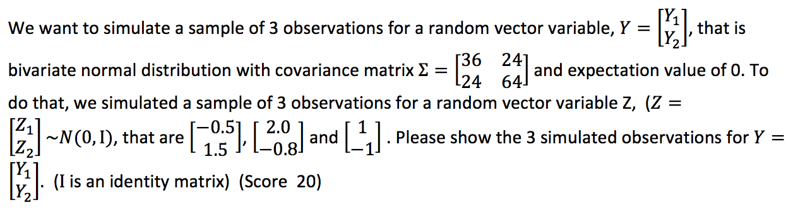

## <span style="color:red">Question 1</span>



***

$\sigma_{Y_1} = \sqrt{36} = 6, \  \sigma_{Y_2} = \sqrt{64} = 8$  

$\rho = \frac{Cov(Y_1, Y_2)}{\sigma_{Y_1}\sigma_{Y_2}} = \frac{24}{6*8} = 0.5$  

$\mu_{Y_1} = \mu_{Y_2} = 0$  

$Y_1 = \sigma_{Y_1}Z_1 + \mu{Y_1} = 6Z_1$  

$Y_2 = \sigma_{Y_2}(\rho Z_1 + \sqrt{1-\rho ^2}Z_2) + \mu_{Y_2} = 8(\frac{1}{2}Z_1 + \frac{\sqrt{3}}{2}Z_2) = 4Z_1 + 4\sqrt{3}Z_2$  
 
So the 3 simulated observations for Y are:  

$\begin{bmatrix} -3 \\ 6\sqrt{3}-2\end{bmatrix}$, $\begin{bmatrix} 12 \\ 8 - \frac{16\sqrt{3}}{5}\end{bmatrix}$, $\begin{bmatrix} 6 \\ 4-4\sqrt{3}\end{bmatrix}$


## <span style="color:red">Question 2</span>


<span style="color:orange">(1) Show how to transform Y into standard normal distribution Z~N(0,Ι_4×4), based on cholesky decomposition. (Ι_4×4 is an identity matrix) (Score 20)</span>

***

First of all, we use Cholesky Decomposition to find the lower triangular matrix L of $\Sigma$  

$LL^T = \Sigma$  

*** 

Then, we generate matrix Z = $[Z_1,Z_2,Z_3,Z_4]^T$where Cov($Z_i,Z_j$) = 0 for $i\neq j$ and 1 for $i = j$, so, Cov(Z) = $I_{4 \times 4}$  

And let Y = LZ  

*** 

$E(LZ) = LE(Z) = L*0 = 0$  

$Cov(LZ) = LCov(Z)L^T = LL^T = \Sigma$  

So Y = LZ ~ N(0, $\Sigma$)  

***

Transform Y ~ N(0, $\Sigma$) to Y ~ N(0,1)  

Let $Y = L^{-1}LZ$  

$E(L^{-1}LZ) = L^{-1}E(LZ) = 0$  

$Cov(L^{-1}LZ) = ICov(Z)I^T = I_{4\times 4}$  

So $Y = L^{-1}LZ \sim N(0, I_{4\times 4})$  


<span style="color:orange">(2) What are the eigenvectors and eigenvalues of Sigma? (Score 20)</span>

*** 

```{r}
Sigma = as.matrix(t(data.frame(c(4,3,4,9),c(3,9,6,6),c(4,6,16,4),c(9,6,4,25))))
ev <- eigen(Sigma)
```

The eigenvalues are:
```{r}
ev$values
```
$\lambda_1 = 33.1672449$  

$\lambda_2 = 15.5090883$  

$\lambda_3 = 5.0315730$  

$\lambda_4 = 0.2920938$  

The eigenvectors are:
```{r}
ev$vectors[,1]
ev$vectors[,2]
ev$vectors[,3]
ev$vectors[,4]
```

$\mu_1 = \begin{bmatrix}-0.3321330\\ -0.3332248\\ -0.3794714\\ -0.7966495 \end{bmatrix}$  

$\mu_2 = \begin{bmatrix}0.02963558\\ -0.28389298\\ -0.81958885\\  0.49679032\end{bmatrix}$  

$\mu_3 = \begin{bmatrix}-0.1197872 \\0.8990730 \\-0.3984055\\-0.1363518\end{bmatrix}$  

$\mu_4 = \begin{bmatrix}0.935125880\\0.005812957\\-0.159839316\\-0.316160072\end{bmatrix}$  

<span style="color:orange">(3)	Please show the steps to generate a new transformed random variable W that will completely represent Y using method of principal component analysis (PCA).  What is the total variance of W? (i.e. sum of variance of each W’s scalar variable). (Score 20)</span>

*** 

Bssed on Spectral Decompostion $\Sigma = Q\Lambda Q^T$  

Q and $Q^T$: 
```{r}
# Q
Q <- ev$vectors
Q
# t(Q)
Q_T <- t(Q)
Q_T
```

Then $W = Q^T Y = \begin{bmatrix}\mu_1^TY\\\mu_2^TY\\\mu_3^TY\\\mu_4^TY  \end{bmatrix}$  

$Var(W) = Var(Q^T Y) = Q^TVar(Y)Q = Q^T(Q\Lambda Q^T)Q = \Lambda$  

Total Variance of W = $\lambda_1 + \lambda_2 + \lambda_3 + \lambda_4$  

```{r}
sum(ev$values)
```
The total variance of W is 54


<span style="color:orange">(4) The original Y is a 4 by 1 dimension of vector. Please show the steps to generate a new transformed random variable V with reduced dimension that can explain at least 80% of total variance of Y using method of principal component analysis (PCA). (Score 20)</span>

*** 

$\Sigma = Q\Lambda Q^T$  

Then $V_i = \mu_iY$  

The eigenvalues are:  
```{r}
ev$values
```

$\lambda_1 = 33.1672449$  

$\lambda_2 = 15.5090883$  

$\lambda_3 = 5.0315730$  

$\lambda_4 = 0.2920938$  

$\frac{\lambda_1 + \lambda_2}{\lambda_1 + \lambda_2 + \lambda_3 + \lambda_4} = 0.90$  

So we select the first 2 number of $V_i$.    

Then $V = \begin{bmatrix}\mu_1Y\\ \mu_2Y\end{bmatrix}$