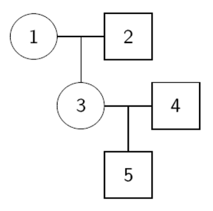
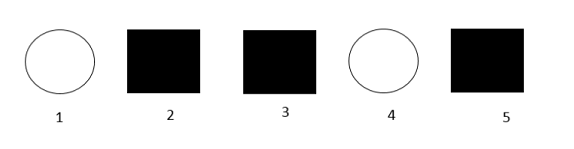
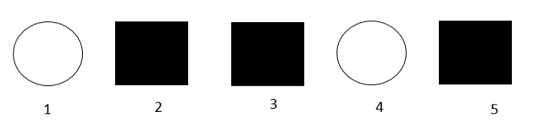
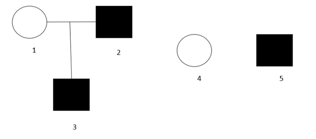
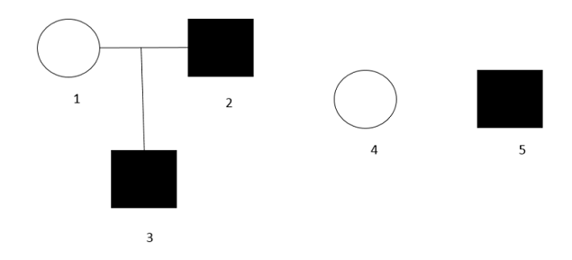

## Question 1

Following is a sample of 1,000 gametes produced by a trihybrid individual. Please answer the following questions. Label each gamete (or haplotype) as non-recombinant, single recombinant or double recombinant.  (Score 15)

Recombinant probability $\theta$ has to be $\leq 0.5$ and non-recombinat probability has to be $\geq 0.5$. There are 1000 gametes and the total number of the two non-recombinant haplotypes shoule be greater or equal than 500, hence Btr|bTR should be the individual's diplotype. Below is my infer,

Haplotype | Label
------------- | -------------
BTR | single recombinant
btr | single recombinant
Btr | non-recombinant
bTR | non-recombinant
BtR | single recombinant
bTr | single recombinant
BTr | double recombinant
btR | double recombinant

## Question 2

What is the probability of following pedigree genotype? If f(D)=0.1 and genotypes for subject 1, 2, 3, 4, and 5 are G1 = DD, G2 = DD, G3 = G4 = G5 = Dd? (Score 15)

$Pr(D) = 0.1 => Pr(d) = 0.9$  

$Pr(DD) = 0.01, Pr(Dd) = 0.18, Pr(dd) = 0.81$

$Pr(G1, G2, G3, G4, G5)$  

$= Pr(G1)Pr(G2)Pr(G3 | G1, G2)Pr(G4)Pr(G5|G3, G4)$

Because there is no way $G3$ can be Dd given her parents don't contain d in there genotype, $Pr(G3 | G1, G2) = 0$.  

Hence,  

$Pr(G1, G2, G3, G4, G5) = 0$  

## Question 3
Suppose an autosome locus has alleles of D and d with f(D)=0.1 and penetrance, Pr(Y = 1|G1 = DD) = 0.8, Pr(Y = 1|G1 = Dd) = 0.4, and Pr(Y = 1|G1 = dd) = 0.2. We collected a sample as following and all individuals have genotypes of Dd. What is the sample’s joint probability Pr(Y1, Y2, Y3, Y4, Y5, G1, G2, G3, G4, G5)? (Score 15)

$Pr(D) = 0.1 => Pr(d) = 0.9$  

$Pr(DD) = 0.01, Pr(Dd) = 0.18, Pr(dd) = 0.81$  

$Pr(Y=1 | G1 = DD = 0.8) => Pr(Y=0 | G1 = DD = 0.2)$  

$Pr(Y=1 | G1 = Dd = 0.4) => Pr(Y=0 | G1 = Dd = 0.6)$  

$Pr(Y=1 | G1 = dd = 0.2) => Pr(Y=0 | G1 = DD = 0.8)$  

---  

$Pr(Y1, Y2, Y3, Y4, Y5, G1, G2, G3, G4, G5)$

$= Pr(Y1|G1)*Pr(Y2|G2)*Pr(Y3|G3)*Pr(Y4|G4)*Pr(Y5|G5)*Pr(G1,G2,G3,G4,G5)$  

all individuals are independent  

$= Pr(Y1|G1)*Pr(Y2|G2)*Pr(Y3|G3)*Pr(Y4|G4)*Pr(Y5|G5)*Pr(G1)*Pr(G2)*Pr(G3)*Pr(G4)*Pr(G5)$  

$= Pr(Y=0|G1=Dd)^2 * Pr(Y=1|G1 = Dd)^3 * Pr(Dd)^5$  

$= 0.6^2 * 0.4^2 * 0.18^5 = 0.00001088391$

## Question 4
Suppose an autosome locus has alleles of D and d with f(D)=0.1 and penetrance, Pr(Y = 1|G1 = DD) = 0.8, Pr(Y = 1|G1 = Dd) = 0.4, and Pr(Y = 1|G1 = dd) = 0.2. We collected a sample as following and we do not have their genotypes. What is the sample’s joint probability Pr(Y1, Y2, Y3, Y4, Y5, G1, G2, G3, G4, G5)? (Score 15)

 

$Pr(D) = 0.1 => Pr(d) = 0.9$  

$Pr(DD) = 0.01, Pr(Dd) = 0.18, Pr(dd) = 0.81$  

$Pr(Y=1 | G1 = DD = 0.8) => Pr(Y=0 | G1 = DD = 0.2)$  

$Pr(Y=1 | G1 = Dd = 0.4) => Pr(Y=0 | G1 = Dd = 0.6)$  

$Pr(Y=1 | G1 = dd = 0.2) => Pr(Y=0 | G1 = DD = 0.8)$  

--- 

$Pr(Y=0)$

$= Pr(Y=0, DD) + Pr(Y=0, Dd) + Pr(Y=0, dd)$  

$= Pr(Y=0|DD)Pr(DD) + Pr(Y=0|Dd)Pr(Dd) + Pr(Y=0|dd)Pr(dd)$  

$= 0.2*0.01 + 0.6*0.18 + 0.8*0.81 = 0.758$  

--- 

$Pr(Y=1)$

$= Pr(Y=1, DD) + Pr(Y=1, Dd) + Pr(Y=1, dd)$  

$= Pr(Y=1|DD)Pr(DD) + Pr(Y=1|Dd)Pr(Dd) + Pr(Y=1|dd)Pr(dd)$  

$= 0.8*0.01 + 0.4*0.18 + 0.2*0.81 = 0.242$ 

--- 

We don't know the sample's genotypes and all of them are independent, so, when calculating the joint probability we can just ignore their genotypes.  

$Pr(Y1, Y2, Y3, Y4, Y5, G1, G2, G3, G4, G5)$  

$= Pr(Y1)*Pr(Y2)*Pr(Y3)*Pr(Y4)*Pr(Y5)$  

$= Pr(Y=0)^2*Pr(Y=1)^3$  

$= 0.758^2 * 0.242^3 = 0.00814300139$

## Question 5

Suppose an autosome locus has alleles of D and d with f(D)=0.1 and penetrance, Pr(Y = 1|G1 = DD) = 0.8, Pr(Y = 1|G1 = Dd) = 0.4, and Pr(Y = 1|G1 = dd) = 0.2. We collected a sample as following and all individuals have genotypes of Dd. What is the sample’s joint probability Pr(Y1, Y2, Y3, Y4, Y5, G1, G2, G3, G4, G5)? (Score 20)

$Pr(D) = 0.1 => Pr(d) = 0.9$  

$Pr(DD) = 0.01, Pr(Dd) = 0.18, Pr(dd) = 0.81$  

$Pr(Y=1 | G1 = DD = 0.8) => Pr(Y=0 | G1 = DD = 0.2)$  

$Pr(Y=1 | G1 = Dd = 0.4) => Pr(Y=0 | G1 = Dd = 0.6)$  

$Pr(Y=1 | G1 = dd = 0.2) =>Pr(Y=0 | G1 = DD = 0.8)$ 

---
$Pr(Y1, Y2, Y3, Y4, Y5, G1, G2, G3, G4, G5)$  

$= Pr(Y1|G1)*Pr(Y2|G2)*Pr(Y3|G3)*Pr(Y4|G4)*Pr(Y5|G5)*Pr(G1,G2,G3,G4,G5)$  

$= Pr(Y1|G1)*Pr(Y2|G2)*Pr(Y3|G3)*Pr(Y4|G4)*Pr(Y5|G5)*Pr(G1)*Pr(G2)*Pr(G3|G1,G2)*Pr(G4)*Pr(G5)$  

$= Pr(Y=0|G1=Dd)^2*Pr(Y=1|G1=Dd)^3*Pr(Dd)^4*0.5$  

$= 0.6^2 * 0.4^3 * 0.18^4 * 0.5 = 0.00001209323$

## Question 6
Suppose an autosome locus has alleles of D and d with f(D)=0.1 and penetrances, Pr(Y = 1|G1 = DD) = 0, Pr(Y = 1|G1 = Dd) = 0, and Pr(Y = 1|G1 = dd) = 1. We collected a sample as following and we do not have their genotypes. What is the sample’s joint probability Pr(Y1, Y2, Y3, Y4, Y5, G1, G2, G3, G4, G5)? (score 20)

$Pr(D) = 0.1 => Pr(d) = 0.9$  

$Pr(DD) = 0.01, Pr(Dd) = 0.18, Pr(dd) = 0.81$  

$Pr(Y=1 | G1 = DD = 0) => Pr(Y=0 | G1 = DD = 1)$  

$Pr(Y=1 | G1 = Dd = 0) => Pr(Y=0 | G1 = Dd = 1)$  

$Pr(Y=1 | G1 = dd = 1) =>Pr(Y=0 | G1 = DD = 0)$ 

Based on the penetrances, we can conclude that people who has been affected have only one possiable genotype: dd. So, individual 2, individual 3 and individual 5 have genotype dd.  

Because invidual 3's genotype(dd) is inherited from individual 2(dd) and individual 1(?). And for people who are not affected there are two possiable genotypes: DD and Dd, and individual 1's genotype can only be Dd.  

So till now, there is only one individual's genotype is unknown - individual 4. Due to 4 has not been affected, we will consider two genotypes for him(DD and Dd) when calculating the joint probability.  

$Pr(Y1, Y2, Y3, Y4, Y5, G1, G2, G3, G4, G5)$  

$= Pr(Y1|G1)*Pr(Y2|G2)*Pr(Y3|G3)*Pr(Y4|G4)*Pr(Y5|G5)*Pr(G1,G2,G3,G4,G5)$  

$= Pr(Y1|G1)*Pr(Y2|G2)*Pr(Y3|G3)*Pr(Y4|G4)*Pr(Y5|G5)*Pr(G1)*Pr(G2)*Pr(G3|G1,G2)*Pr(G4)*Pr(G5)$  

---  

$Pr(Y1|G1) = Pr(Y=0|Dd) = 1$  

$Pr(Y2|G2) = Pr(Y=1|dd) = 1$  

$Pr(Y3|G3) = Pr(Y=1|dd) = 1$  

$Pr(Y4|G4) = Pr(Y=0|DDorDd) = 1$  

$Pr(Y5|G5) = Pr(Y=1|dd) = 1$  

$Pr(G1) = Pr(Dd) = 0.18$  

$Pr(G2) = Pr(G3) = Pr(G5) = Pr(dd) = 0.81$  

$Pr(G3|G1,G2) = Pr(dd|Dd,dd) = 0.5$

---  

Ans = $1*1*1*1*1*0.18*0.81^3*0.5 = 0.04782969$
