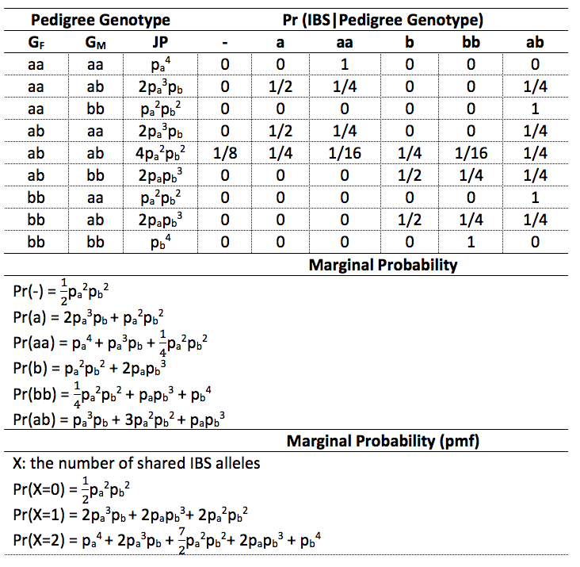

```{r include=FALSE}
knitr::opts_chunk$set(echo = TRUE)
```

## <span style="color:red">Question 1</span>
<span style="color:orange">Let X=the number of shared IBD alleles (Score: 15)</span>

<span style="color:orange">a.	What is the distribution of X for a sibling pair and what is the coefficient of relationship and kinship coefficient? (Score 5)</span>

For a sibling pair, X could be 0, 1, 2  

$f_X(x) = \begin{cases}\pi_0,\ if\  x = 0\\ \pi_1,\  if \ x = 1 \\ \pi_2,\  if \ x =2\end{cases}$  

And in this case, $\pi_0 = \frac{1}{4}$, $\pi_1 = \frac{1}{2}$, $\pi_2 = \frac{1}{4}$  

Coeficaient of relationship: $E(x) = 0 * \pi_0 + 1 * \pi_1 + 2*\pi_2 \\ = 0 + \frac{1}{2} + \frac{1}{2} = 1$  

Kinship coefficient: $\varphi = \frac{E(X)}{4} = \frac{1}{4}$


<span style="color:orange">b.	What is the distribution of X for a parent-child pair and what is the coefficient of relationship and kinship coefficient? (Score 5)</span>

There is only one shared IBD allele between a parent-child pair, and it is also the only situation can happen for a parent-child pair.  

$\pi_0 = 0$, $\pi_1 = 1$, $\pi_2 = 2$  

Coeficaient of relationship: $E(x) = 0 * \pi_0 + 1 * \pi_1 + 2*\pi_2 \\ = 0 + 1*1 + 0 = 1$  

Kinship coefficient: $\varphi = \frac{E(X)}{4} = \frac{1}{4}$


<span style="color:orange">c.	What is the distribution of X for a grandparent-grandchild pair and what is the coefficient of relationship and kinship coefficient? (Score 5)</span>

There must be one shared IBD allele between a parent-child pair, hence, the child must has an allele which is come from his/her grandmother or grandfather.  

So, $\pi_0 = 0$, $\pi_1 = \frac{1}{2}$, $\pi_2 = 0$  

Coeficaient of relationship: $E(x) = 0 * \pi_0 + 1 * \pi_1 + 2*\pi_2 \\ = 0 + 1*\frac{1}{2} + 0 = \frac{1}{2}$  

Kinship coefficient: $\varphi = \frac{E(X)}{4} = \frac{1}{8}$


## <span style="color:red">Question 2</span>

<span style="color:orange">Suppose a disease has autosome dominant inheritance of allele D for a gene locus with allele D and d (i.e. Pr(Y=1|G)=1 if G=DD or Dd, and Pr(Y=1|G)=0 if G=dd). Let X=the number of shared IBD alleles between an affected sibling pair. (Score: 15)</span>

<span style="color:orange">a.	If father genotype is Dd and mother genotype is dd, what is probability of X=0, 1 and 2 respectively? (Score: 5)</span>

Children's possible genotypes:  

$D_fd_f\ \times\  d_{m1}d_{m2} => \begin{cases}D_fd_{m1},\ Pr = \frac{1}{4} \\ D_fd_{m2},\ Pr = \frac{1}{4} \\d_fd_{m1},\ Pr = \frac{1}{4} \\d_fd_{m2},\ Pr = \frac{1}{4} \end{cases}$

And among those four cases, only $D_fd_{m1}$ and $D_fd_{m2}$ are affected genotype.  

$Pr(D_fd_{m1}) =  Pr(D_fd_{m2}) = \frac{\frac{1}{4}}{\frac{1}{4} + \frac{1}{4}} = \frac{1}{2}$  

By multiplication rule we can calculate the frequency for each X :  

$(\frac{1}{2}D_fd_{m1} + \frac{1}{2}D_fd_{m2})^2$  

$= \frac{1}{4}(D_fd_{m1}, D_fd_{m1}) + \frac{1}{4}(D_fd_{m2}, D_fd_{m2}) + \frac{1}{2}(D_fd_{m1}, D_fd_{m2})$  

X | Offerspring Genotypes | Probability
--- | ----------------------------- | ------
1 |  $(D_fd_{m1}, D_fd_{m2})$ | $\frac{1}{2}$
2 | $(D_fd_{m1}, D_fd_{m1})$, $(D_fd_{m2}, D_fd_{m2})$ | $\frac{1}{2}$

So,  

$Pr(x) = \begin{cases}0,\  x = 0 \\ \frac{1}{2},\ x = 1 \\ \frac{1}{2},\ x = 2\end{cases}$


<span style="color:orange">b.	If father genotype is Dd and mother genotype is also Dd, what is the distribution of X? what is E(X)? and what is the Var(X)? (Score: 10)</span>

Children's possible genotypes:  

$D_fd_f\ \times\  D_{m}d_{m} => \begin{cases}D_fD_{m},\ Pr = \frac{1}{4} \\ D_fd_{m},\ Pr = \frac{1}{4} \\d_fD_{m},\ Pr = \frac{1}{4} \\d_fd_{m},\ Pr = \frac{1}{4} \end{cases}$  

And among those four cases, there are three affected genotypes:  

$Pr(D_fD_{m}) = Pr(D_fd_{m}) = Pr(d_fD_{m}) = \frac{1/4}{1/4+1/4 +1/4} = \frac{1}{3}$  

By multiplication rule we can calculate the frequency for each X : 

$(\frac{1}{3}D_fD_m + \frac{1}{3}D_fd_m + \frac{1}{3}d_fD_m)^2$  

$= \frac{1}{9}(D_fD_m,D_fD_m) + \frac{1}{9}(D_fd_m,D_fd_m) + \frac{1}{9}(d_fD_m,d_fD_m) + \frac{2}{9}(D_fD_m,D_fd_m) + \frac{2}{9}(D_fD_m,d_fD_m) +\frac{2}{9}(D_fd_m,d_fD_m)$  


X | Offerspring Genotypes | Probability
--- | --------------------------------| ------
0 | $(D_fd_m,d_fD_m)$ | $\frac{2}{9}$
1 | $(D_fD_m,D_fd_m)$, $(D_fD_m,d_fD_m)$ | $\frac{4}{9}$
2 | $(D_fD_m,D_fD_m)$, $(D_fd_m,D_fd_m)$, $(d_fD_m,d_fD_m)$ | $\frac{1}{3}$


So,  

$Pr(x) = \begin{cases}\frac{2}{9},\  x = 0 \\ \frac{4}{9},\ x = 1 \\ \frac{1}{3},\ x = 2\end{cases}$  

$E(X) = 0*\frac{2}{9} + 1*\frac{4}{9} + 2*\frac{1}{3} = \frac{10}{9}$  

$E(X^2) = 0*\frac{2}{9} + 1*\frac{4}{9} + 4*\frac{1}{3} = \frac{16}{9}$  

$Var(X) = E(X^2) - E(x)^2 = \frac{16}{9} - (\frac{10}{9})^2 = \frac{52}{27}$


## <span style="color:red">Question 3</span>
<span style="color:orange">Let X be the number of shared IBS alleles for a sibling pair with Dd genotype for both parents. What are the E(X) (Score 10) and Var(X)? (Score 15) </span>  

Children's possible genotypes:  

$$Dd\ \times\  Dd => \begin{cases}DD,\ Pr = \frac{1}{4} \\ Dd,\ Pr= \frac{1}{2} \\ dd,\ Pr = \frac{1}{4}  \end{cases}$$

By multiplication rule we can calculate the frequency for each X:  

$(\frac{1}{4}DD + \frac{1}{2}Dd + \frac{1}{4}dd)^2$  

$= \frac{1}{16}(DD,DD) + \frac{1}{4}(Dd,Dd) + \frac{1}{16}(dd,dd) + \frac{1}{4}(DD,Dd) + \frac{1}{8}(DD,dd) + \frac{1}{4}(Dd,dd)$  

X | Offerspring Genotypes | Probability
--- | --------------------------------| -----
0 | $(DD,dd)$ | $\frac{1}{8}$
1 | $(DD,Dd)$, $(Dd,dd)$ | $\frac{1}{2}$
2 | $(DD,DD)$, $(Dd,Dd)$, $(dd,dd)$ | $\frac{3}{8}$  

So,  

$Pr(x) = \begin{cases}\frac{1}{8},\  x = 0 \\ \frac{1}{2},\ x = 1 \\ \frac{3}{8},\ x = 2\end{cases}$  


$E(X) = 0*\frac{1}{8} + 1*\frac{1}{2} + 2*\frac{3}{8} = \frac{5}{4}$  

$E(X^2) = 0*\frac{1}{8} + 1*\frac{1}{2} + 4*\frac{3}{8} = 2$  

$Var(X) = E(X^2) - E(X)^2 = 2 - (\frac{5}{4})^2 = \frac{7}{16}$


## <span style="color:red">Question 4</span>
<span style="color:orange">a. Fill out the table below. X is a random variable for the number of shared IBS (Score: 10)</span>




<span style="color:orange">b.  For a sibling pair, if pa= 0.5, what is  Pr(X=0), Pr(X=1) and Pr(X=2), respectively? What is the E(X) and Var(X)? What are the answers if pa=  0.01. (Score: 5)</span>

If $p_a = 0.5$  

$Pr(X=0) = 0.5 * 0.5^2 * 0.5^2 = 0.5^5 = 0.03125$  

$Pr(X=1) = 2 * 0.5^4 + 2 *0.5 ^4 + 2 *0.5 ^4  = 0.375$  

$Pr(X=2) = 0.5^4 + 2*0.5^4 + 3.5*0.5^4 + 2*0.4^4 + 0.5^4 = 0.59375$  

$E(X) = 0*0.03125 + 1*0.375 + 2*0.59375 = 1.5625$  

$E(X^2) = 0*0.03125 + 1*0.375 + 4*0.59375 = 2.75$  

$Var(X) = E(X^2) - E(X)^2 = 2.75 - 1.5625^2 = 0.30859375$

***

If $p_a = 0.01$

$Pr(X=0) = 0.5 * 0.01^2 * 0.99^2 = 0.000049005$  

$Pr(X=1) = 2 * 0.01^3 * 0.99 + 2 *0.01 * 0.99^3 + 2 *0.01^2 * 0.99^2  = 0.01960398$  

$Pr(X=2) = 0.01^4 + 2*0.01^3 * 0.99 + 3.5*0.01^2 * 0.99^2 + 2*0.01 * 0.99^3 + 0.99^4 = 0.980347015$  


## <span style="color:red">Question 5</span>
<span style="color:orange">Causal locus (D and d), LD locus(A and a), f(D) = 0.4, f(A|D) = 0.9, f(A|d) = 0.2. What is the frequency of haplotype DA, haplotype Da, haplotype dA, haplotype da and genotype DdAa in the population? (Score: 10)</span>

f(D) = 0.4, f(d) = 0.6  

f(A|D) = 0.9, f(a|D) = 0.1  

f(A|d) = 0.2, f(a|d) = 0.8

Pr(DA) = f(A|D)f(D) = 0.9 * 0.4 = 0.36  

Pr(Da) = f(a|D)f(D) = 0.1 * 0.4 = 0.04  

Pr(dA) = f(A|d)f(d) = 0.2 * 0.6 = 0.12  

Pr(da) = f(a|d)f(d) = 0.8 * 0.6 = 0.48  

Genotype DdAa has two possible haplotype combinations: DA-da and Da-dA.  

Based on multiplication rules, we can get:  

Pr(DdAa) = 2 * 0.36 * 0.48 + 2 * 0.04 * 0.12 = 0.3552


## <span style="color:red">Question 6</span>
<span style="color:orange">Causal locus (D and d), LD locus( A and a), f(D) = 0.4, f(A|D) = 0.9, f (A|d) = 0.2. Genotype variable X : the number of D and genotype variable Y : the number of A. What is the covariance of X and Y ? and What is the Correlation? (Score 10) </span>

f(D) = 0.4, f(d) = 0.6  

f(A|D) = 0.9, f(a|D) = 0.1  

f(A|d) = 0.2, f(a|d) = 0.8

Pr(DA) = f(A|D)f(D) = 0.9 * 0.4 = 0.36  

Pr(Da) = f(a|D)f(D) = 0.1 * 0.4 = 0.04  

Pr(dA) = f(A|d)f(d) = 0.2 * 0.6 = 0.12  

Pr(da) = f(a|d)f(d) = 0.8 * 0.6 = 0.48 

From multiplcation rule:  

$(0.36DA + 0.04Da + 0.12dA + 0.48da)^2$  

$= 0.1296(DDAA) + 0.0016(DDaa) + 0.0144(ddAA) + 0.2304(ddaa) + 0.0288(DDAa) + 0.0864(DdAA) + 0.3456(DdAa) + 0.0096(DdAa) + 0.0384(Ddaa) + 0.1152(ddAa)$  

For variable X(the number of D):  

X | Genotype | Probablity
--- | ------------------------- | --------
0 | ddAA, ddaa, ddAa| 0.36
1 | DdAA, DdAa, Ddaa| 0.48
2 | DDAA, DDaa, DDAa| 0.16

E(X) = 0.48 + 0.16*2 = 0.8  

$E(X^2) = 0.48 + 0.16*4 = 1.12$  

$Var(X) = E(X^2) - E(X)^2 = 1.12 - 0.8^2 = 0.48$  

$sd(X) = \sqrt{Var(X)} = 0.69282$            

For variable Y(the number of A):  

Y | Genotype | Probablity
--- | ------------------------- | --------
0 | aaDD, aaDd, aadd | 0.2704
1 | AaDD, AaDd, Aadd | 0.4992
2 | AADD, AADd, AAdd | 0.2304  

E(Y) = 0.4992 + 0.2304*2 = 0.96  

$E(Y^2) = 0.4992 + 0.2304*4 = 1.4208$  

$Var(Y) = E(Y^2) - E(Y)^2 = 1.4208 - 0.96^2 = 0.4992$  

$sd(Y) = \sqrt{Var(Y)} = 0.70654$

For variable (XY):  

XY | Genotype | Probablity
--- | ------------------------- | --------
0 | DDaa, ddAA, ddaa, Ddaa, ddAa | 0.4
1 | DdAa | 0.3552
2 | DDAa, DdAA | 0.1152
4 | DDAA | 0.1296  

E(XY) = $0.3552 + 0.1152*2 + 0.1296*4$ = 1.104

Cov(X,Y) = E(XY) - E(X)E(Y) = 1.104 - 0.8*0.96 = 0.336  

Corr(X,Y) = $\frac{Cov(X,Y)}{sd(X)sd(Y)} = \frac{0.336}{0.69282*0.70654} = 0.6864$  

The covariance of X and Y is 0.336 and the Correlation is 0.6864.  


## <span style="color:red">Question 7</span>
<span style="color:orange">Causal locus (D and d), LD locus (A and a), f(D) = 0.4, f(A|D) = 0.9, f(A|d) = 0.2. Dichotomous allele variable X: the number of D and dichotomous allele variable Y: the number of A. What is the covariance of X and Y ? (i.e. LD measure δ) and What is the Correlation? (i.e. LD measure r) (Score 10)</span>

f(D) = 0.4, f(d) = 0.6  

f(A|D) = 0.9, f(a|D) = 0.1  

f(A|d) = 0.2, f(a|d) = 0.8  

Variable X:  

X = 1: f(D) = 0.4  

X = 0: f(d) = 0.6  

E(X) = f(D) = 0.4    

Var(X) = f(D)(1-f(D)) = 0.4*0.6 = 0.24  

Variable Y:  

Y = 1: $f(A) = f(A|D)f(D) + f(A|d)f(d) = 0.9*0.4 + 0.2*0.6 = 0.48$  

Y = 0: $f(a) = f(a|D)f(D) + f(a|d)f(d) = 0.1*0.4 + 0.8*0.6 = 0.52$  

E(Y) = f(A) = 0.48  

Var(Y) = f(A)(1-f(A)) = 0.48*0.52 = 0.2496  

***  

E(XY) = f(DA) = f(A|D)f(D) = 0.9 * 0.4 = 0.36  

Cov(X,Y) = E(XY) - E(X)E(Y) = 0.36 - 0.4*0.48 = 0.168  

Corr(X,Y = $\frac{Cov(X,Y)}{\sqrt{Var(X)}\sqrt{Var(Y)}} =\frac{0.168}{\sqrt{0.24}\sqrt{0.2496}} = 0.686$

The covariance of X and Y is 0.168 and the Correlation is 0.686.  
