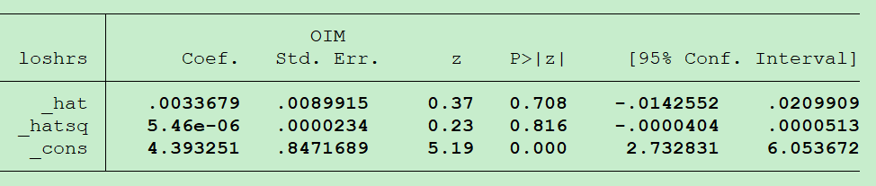

## Assessing the Link Function

> Pregibon link test   

1. Run GLM.  

2. Obtain fitted values for linear predictor.  

3. Create new variables $(X\hat{\beta})^2$.  

4. Run model with $X\hat{\beta} + (X\hat{\beta})^2$ as predictors.  

5. evaluate: if p-value is not significant for $(X\hat{\beta})^2$ term, link function is correctly specified.  

The p-value for _hatsq is greater 0.05 which is not statistically significant indicatiing that the model seems to be well specified.

## Outlier Detection

>Cook’s distance measures the aggregate change in the estimated coefficients when each observation is left out of the estimation. 

### Rules of thumb:

- $C_i > \frac{4}{n-p-1}$  n = number of total observations. p = number of coefficients  

- $C_i > \frac{3\sum{C_i}}{n}$  

- $C_i > 1$

 
## R-square 

In ordinary least squares(OLS) regression, $R^2 = 1 - \frac{\sum_{i=1}^N(y_i - \hat{y_i})^2}{\sum_{i=1}^N(y_i - \bar{y})^2}$  

- N is the number of pbservations in the model.  

- y is the dependent variable.  

- y-hat is the value predicted by the model.  

$R^2$ is typically interpreted as % variance explained, but $Pseudo-R^2 = (correlation(y,\hat{y}))^2$  

## Information Criteria  

The AIC and BIC are two popular measures for comparing maximum likelihood models.[^1]    

> AIC = Akaike Information Criterion

$AIC = -2*ln(likelihood) + 2*k$

> BIC = Bayesian Information Criterion

$BIC = -2*ln(likelihood) + ln(N)*k$  

- k = number of parameters estimated  

- N = number of observations

AIC and BIC can be viewed as measures that combine fit and complexity.  

Fit is measured negatively by −2 × ln(likelihood); the larger the value, the worse the fit.  

Complexity is measured positively, either by 2 × k (AIC) or ln(N) × k (BIC).  

Given two models fit on the same data, the model with the smaller value of the information criterion is considered to be better.

[^1]: https://www.stata.com/manuals/rbicnote.pdf

## Residuals

